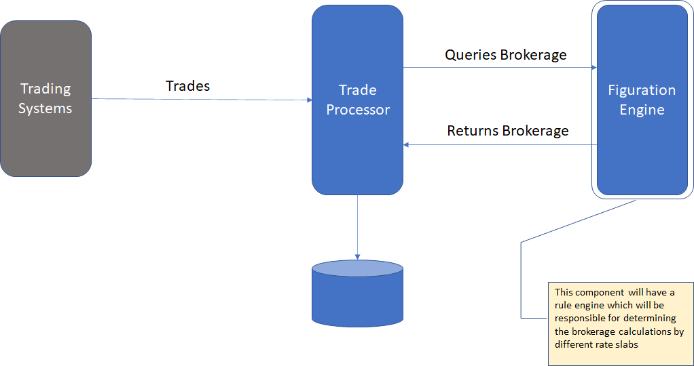
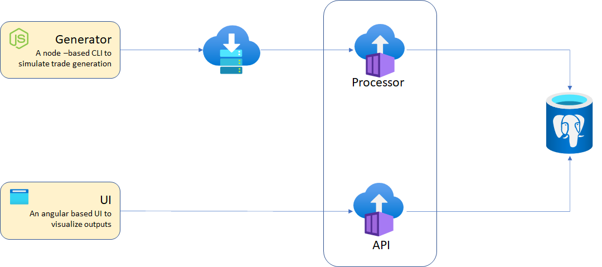

# Prototype of Online Figuration Engine

## Introduction

_Figuration_ in FinTech industry signifies calculation of brokerage amount for the trades.

In today's world, stock market allows direct stream of the trades to a broker for processing on the fly. This allows the broker to calculate the amounts payable, receivable and brokerage in a _near real-time_ sense.

This prototype shows how Azure components can be used to receive and process the trades and calculate brokerage. The brokerage calculation is done using a rules engine, which allows customization and easier rate slab management.

For the purpose of this prototype, we have considered a single tiered rate slab for calculating the brokerage.

The diagram below provides a functional view:

## Design

The diagram below provides the deployment view:

The processor and rule engine is clubbed into a single container for processor. A simple Angular based UI is provided to see the outputs and statistics. A simple API instance is created to serve data to Angular application.

The simulation of trade streams is done through _tradecli_. This utility places the trades in a CSV into a service bus. From where _processor_ picks up does the figuration and saves it in a Postgre SQL database.

Technologies used:

* Node JS
* Express library for API
* json-rules-engine
* Angular
* Service Bus
* Azure Container Instance
* Postgre SQL Flexible Server

## Installation

Execute `script.sh` to build and deploy the components. Its interactive. You can keep default values or change the values in the prompt.

Once done, change the `config.json` file in `tradecli` folder with the values for service bus.

In order to load data execute `node app.js trade1.csv` to load the data in the CSV file into Service Bus. Use the URL of the UI container to see the UI e.g. `http://<FQDN of the UI ACI>`.

## Further Works

* Creating more meaningful datasets for brokerage calculation
* Multiple brokerage slabs and algorithms

## Team

The team for this Hackathon consists of:

* Biswajit Dhar (biswajit.dhar@tcs.com)
* Devanshu Upadhyay (devanshu.upadhyay@tcs.com)
* Priyanka Bujuru (priyanka.bujuru@tcs.com)
